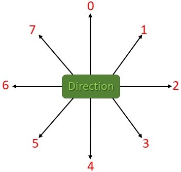
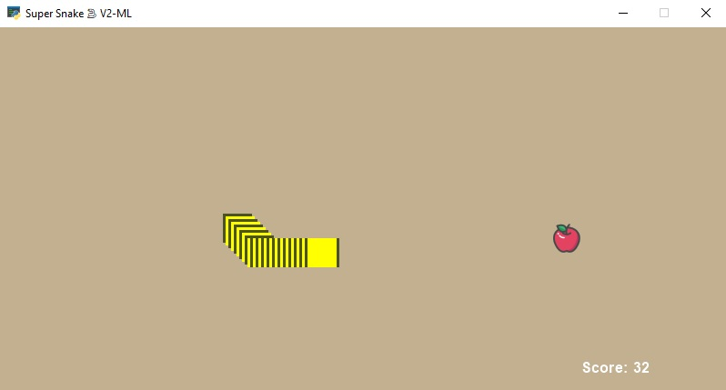
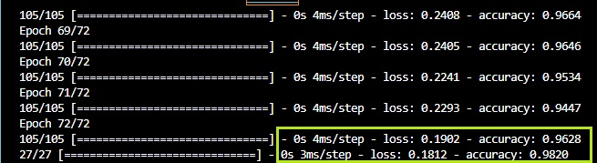

# Snake AI- Machine Learning

Snake game- artificial intelligence version- written in python using arcade library and trained with tensorfelow.


## Description and pictures:

- In my game, the snake can move in 8 directions which I've marked as below:



- Game output at score 32 :




## How to install:

```
pip install -r requirements.txt
```

## How to run:

- First generate dataset:
```
generate_dataset.py
```

- Then train neural network:
```
train.py
```

- Finally play the game:
```
main_ml.py
```

- And enjoy!

## Loss and Accuracy:

|   | Loss | Accuracy |
| :-----: | :-----: | :-----: |
|Train| 0.1902 | 0.9628 |
|Test| 0.1812 | 0.9820 |


